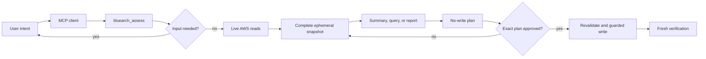

# BlueArch AWS Steward

**BlueArch AWS Steward Beta: an MCP-first, read-only AWS recommendation and
remediation planning engine.**

BlueArch AWS Steward is a local, MCP-first AWS assessment and guarded
remediation engine. It evaluates live AWS configuration against the BlueArch
misconfiguration catalog, returns only resources caught by executable rules,
builds evidence-backed remediation plans, and verifies approved changes.

Steward is standalone. It does not use BlueArch Core, hosted login, hosted
telemetry, or a local AWS inventory database. AWS remains the source of truth.

## What It Provides

- 100 native rules across 16 runtime scopes.
- Searchable knowledge for all 631 `aws-misconfig-db` catalog entries.
- Point-in-time, read-only assessments using user-owned AWS credentials.
- MCP-native clarification for objective, service, profile, and Region.
- Guided, focused, and full-report assessment modes with multi-objective and
  multi-service selection.
- Background assessments with status, partial results, and cancellation.
- Complete ephemeral findings with filtered, cursor-paginated exploration that
  does not rescan AWS.
- Local JSON, Markdown, HTML, CSV, SARIF, and PDF report exports.
- Automatic terminal PDF choice; prompts do not need to request reporting.
- Evidence, risk, cost estimate status/confidence, and remediation safety on every presented finding.
- No assessment applies AWS changes; guarded writes require approval of one exact short-lived plan.
- Structured resource identity and redacted evidence using schema `0.2`.
- Planning for every native finding and guarded apply for eight low-risk rules.
- One prioritized queue combining native Steward, live Security Hub, Compute
  Optimizer, Cost Optimization Hub, and optional Prowler/exported JSON signals.
- Source-independent deduplication with provenance, freshness, confidence,
  evidence, live-validation status, and an explainable 0-100 priority score.

Steward complements broad scanners such as Prowler and AWS Security Hub. It is
not a replacement for either product, a continuous inventory, or an autonomous
AWS administrator. Its focus is the local last mile from a finding to a
reviewed AWS or IaC fix and post-fix verification. See
[`docs/competitive-strategy.md`](docs/competitive-strategy.md) and
[`docs/expansion-plan.md`](docs/expansion-plan.md) for positioning and roadmap.

## Install

Steward requires Python 3.10 or newer. The recommended `uv` installer can
manage a compatible Python runtime and works on macOS and Linux:

```bash
curl -LsSf https://astral.sh/uv/install.sh | sh
```

On macOS, Homebrew is also supported:

```bash
brew install uv
```

The intended public installation is a persistent, isolated `uv` tool:

```bash
uv tool install 'bluearch-aws-steward==0.7.0b1'
uv tool update-shell
bluearch-steward --version
bluearch-steward mcp smoke
```

Register the installed runtime with one or more supported MCP clients:

```bash
bluearch-steward mcp install --client codex
bluearch-steward mcp install --client cursor
bluearch-steward mcp install --client claude
```

Use `--dry-run` to preview changes. Existing client configuration is preserved,
and changed configuration files are backed up before installation. Restart the
client after registration.

For clients that should resolve the exact released package on demand, generate
a version-pinned `uvx` configuration:

```bash
bluearch-steward mcp config --runtime uvx
```

The package is not published yet. The tag-only preview workflow builds and
validates the exact distribution, publishes it to TestPyPI, waits for an
approved `pypi` environment, and only then publishes to PyPI and creates a
GitHub prerelease. Ordinary pushes and pull requests cannot publish packages.

Until then, install a repository checkout:

```bash
git clone https://github.com/bluearchio/bluearch-aws-steward.git
cd bluearch-aws-steward
make dev-sync
```

Configure an MCP client to start the repository runtime over stdio. Use the
absolute repository path in local installations:

```json
{
  "mcpServers": {
    "bluearch-aws-steward": {
      "command": "/absolute/path/bluearch-aws-steward/.venv/bin/bluearch-steward-mcp",
      "args": [],
      "env": {
        "AWS_SDK_LOAD_CONFIG": "1",
        "PYTHONUNBUFFERED": "1"
      }
    }
  }
}
```

`uv run python -m bluearch_aws_steward mcp config` generates this shape with an
absolute environment path. After changing source, run `make dev-sync` and then
restart the MCP server or start a new agent task. This reinstalls the current
checkout instead of allowing an MCP startup to mutate the environment; an
already running Python process does not hot reload modules.

See [`docs/public-installation.md`](docs/public-installation.md) for package,
upgrade, uninstall, and MCP-client setup flows. Maintainers should follow
[`docs/publishing-preview.md`](docs/publishing-preview.md) for the guarded
TestPyPI and PyPI release procedure.

Verify the active runtime at any time:

```bash
make runtime-info
```

The checkout version, installed package metadata version, and runtime version
must match. The check runs outside the repository so a stale package cannot be
hidden by Python importing the working directory.

Do not put credentials, SSO tokens, a default profile, or a default Region in
the MCP configuration. Steward uses the AWS SDK credential chain and asks the
user when multiple contexts are possible.

## First Assessment

1. Configure AWS credentials outside the conversation. AWS SSO users can run:

   ```bash
   aws sso login --profile my-sso-profile
   ```

2. Restart or reconnect the MCP client.
3. Ask:

   > Assess my AWS environment comprehensively. Ask me to select the AWS
   > profile and Region. Show only resources caught by native rules, report
   > skipped rules and coverage.

Steward returns an assessment ID immediately. The client polls status, may read
partial results, and retrieves concise solution cards without starting the scan
again. Every finding remains queryable and exportable from process memory for
15 minutes. A 50,000-finding guard reports `incomplete=true` and an exact reason
instead of silently truncating a complete assessment.

Read-only assessment, finding evidence and risk, cost estimate status and
confidence, individual-plan approval, and the terminal PDF choice are product
defaults; users do not need to request them in the prompt.

See [`docs/prompt-library.md`](docs/prompt-library.md) for focused cost,
security, reliability, catalog, planning, and verification prompts.

### Unified Recommendation Queue

Native rules remain the default. Select additional AWS recommendation sources
when the account has them enabled:

```json
{
  "prompt": "Build one prioritized queue from all available recommendation sources.",
  "services": ["all"],
  "objectives": ["all"],
  "signal_sources": [
    "native",
    "security-hub",
    "compute-optimizer",
    "cost-optimization-hub"
  ]
}
```

Steward reads each selected source during the same point-in-time assessment.
It fingerprints account, Region, canonical resource, and canonical problem;
merges corroborating signals; preserves every source receipt; and returns one
recommendation. Current native evidence can resolve an equivalent stale config
finding, but a narrower native detector never invalidates a broader Compute
Optimizer or Cost Optimization Hub recommendation. Missing permissions or an
AWS service that is not enabled appears under `capability_errors` and
`incomplete_sources`; it is never reported as clean.

`bluearch_query_results` can filter the queue by `sources` and
`validation_statuses`. Every report format includes the fingerprint, source
list, freshness, priority score, evidence, risk, savings estimate/confidence,
and remediation safety.

## MCP Workflow



Primary tools:

| Tool | Purpose | AWS write |
| --- | --- | --- |
| `bluearch_assess` | Resolve intent and start a background assessment. | No |
| `bluearch_list_aws_profiles` | List non-secret AWS profile metadata for user selection. | No |
| `bluearch_import_findings` | Import supported external finding JSON into an ephemeral assessment. | No |
| `bluearch_get_scan_status` | Return progress without repeating work. | No |
| `bluearch_get_scan_results` | Return final or `include_partial` results. | No |
| `bluearch_query_results` | Filter, sort, facet, and paginate the stored snapshot without rescanning. | No |
| `bluearch_export_report` | Export a completed result, including local PDF with charts. | No |
| `bluearch_cancel_assessment` | Stop pending work and preserve completed reads. | No |
| `bluearch_get_resource_details` | Inspect or refresh one matched resource. | No |
| `bluearch_get_coverage` | Report catalog and native detector coverage. | No |
| `bluearch_status` | Check runtime, AWS identity, and rule coverage. | No |
| `bluearch_rules_search` | Search all 631 catalog rules. | No |
| `bluearch_explain_finding` | Explain evidence and impact. | No |
| `bluearch_plan_remediation` | Revalidate and create a short-lived plan. | No |
| `bluearch_apply_remediation` | Apply an exact approved plan. | Guarded |
| `bluearch_verify_remediation` | Re-read AWS and verify selected findings. | No |

The legacy CLI and Textual dashboard remain developer diagnostics. The normal
user flow is MCP.

## Detection Coverage

`bluearch_get_coverage` reports:

| Measure | v0.7.0b1 |
| --- | ---: |
| Catalog rules | 631 |
| Native canonical rules | 100 |
| Native aliases | 7 |
| Runtime scopes | 16 |
| Catalog automation | 15.85% |

Runtime scopes are `iam`, `cloudtrail`, `cloudwatch`, `dynamodb`, `s3`, `ec2`,
`rds`, `lambda`, `efs`, `ecs`, `alb`, `kms`, `secrets-manager`, `sns`, `sqs`,
and `api-gateway`. The aliases `ebs` and `networking` route to the EC2 collector
and do not increase the canonical rule count.

All 100 current rules have `access_tier: free`. This is the stable open-source
baseline. Future canonical rules beyond this baseline are reserved for a
`premium` tier unless the project governance explicitly promotes them. v0.7.0
does not add hosted login, licensing calls, or telemetry; entitlement enforcement
is a separate future boundary.

Every result distinguishes evaluated, skipped, and unevaluated rules. A rule
blocked by provider capability or AWS permissions is skipped with a reason; it
is never reported as passing. Zero findings means only that no evaluated rule
matched.

See [`docs/rule-coverage.md`](docs/rule-coverage.md) for the complete native
rule list and evidence type.

## Release Status

The current `0.7.0b1` work is a release candidate, not a published stable release.
Public-preview and stable-release gates are tracked in
[`docs/public-release-readiness.md`](docs/public-release-readiness.md). The
planned progressive result experience is documented in
[`docs/result-experience-plan.md`](docs/result-experience-plan.md).
Source adapter contracts and the security boundary are documented in
[`docs/source-compatibility.md`](docs/source-compatibility.md) and
[`docs/security-threat-model.md`](docs/security-threat-model.md).

## Safety Model

Read access is generated from the typed operation registry:

- [`iam/read-policy.json`](iam/read-policy.json)
- [`iam/remediation-policy.json`](iam/remediation-policy.json)

Keep those policies on separate roles. Routine assessment needs only the read
policy.

Most findings are planning-only. Guarded apply is limited to:

- S3 public access block, default encryption, lifecycle, versioning, and server
  access logging;
- CloudWatch Logs retention;
- CloudTrail log file validation; and
- ALB access logging.

S3 and ALB logging require a pre-existing destination in the selected Region,
SSE-S3 encryption, and a bucket policy that grants `s3:PutObject` to the
appropriate AWS log-delivery service principal for the requested prefix. An S3
server-access-log destination must not have server access logging enabled; an
ALB prefix must not contain `AWSLogs`. Steward validates these conditions when
planning and immediately before applying. It never creates destination buckets,
bucket policies, credentials, or supporting infrastructure. It does not
automatically delete resources, rotate keys, remove permissions, stop workloads,
change traffic, or perform migrations.

Every write requires:

1. a fresh read that reproduces the finding;
2. a server-held plan with exact operation, preconditions, IAM, rollback, and
   verification;
3. a short expiry and digest;
4. unchanged account, Region, and live resource state; and
5. explicit `allow_write=true` for that exact plan.

## Architecture

```text
MCP client
  -> intent and AWS-context refinement
  -> ephemeral assessment store
      -> concise conversational projection
      -> filtered cursor-paginated exploration
      -> prioritized remediation queue
      -> complete report export
  -> collector registry + ExecutableRuleSpec registry
  -> live recommendation-source adapters + deterministic deduplication
  -> AWS SDK provider (default) or AWS CLI compatibility provider
  -> typed read allowlist + assessment-local metric cache
  -> detectors + structured evidence
  -> plan store + explicit guarded writes
```

Service collectors run with bounded concurrency. A service snapshot is reused
between its rules, and `rule_filter` narrows both rules and AWS calls.
Twenty-four signal rules batch CloudWatch `GetMetricData` requests through an
assessment-local cache. Missing metric data is unknown, never zero.

This release does not include multi-account traversal, all-Region orchestration,
IaC scanning, attack graphs, hosted history, telemetry, or an AWS MCP provider.
See [`docs/expansion-plan.md`](docs/expansion-plan.md) for the planned rule,
LocalEmu, EKS, performance, and IaC remediation expansion path.

## Development

Install quality tools with Python 3.10, 3.11, or 3.13:

```bash
make dev-sync
make test
make quality
make security
make package
```

Run the actual stdio MCP protocol against deterministic LocalEmu fixtures:

```bash
make emulator-doctor
make emulator-mcp-e2e
```

The E2E proves `assess -> status -> partial results -> unified source
deduplication -> concise results -> paginated complete query -> complete PDF ->
plan -> verify` using dummy
credentials and no writes. `make emulator-coverage` also
requires a positive finding for every one of the 100 active rules through the
AWS SDK and AWS CLI providers. Eighty-eight fixtures use LocalEmu APIs directly;
twelve historical, account-level, metric-dimension, or synthetic-size states use
a test-only loopback response overlay documented in
[`tests/aws-emulator/rule-map.yml`](tests/aws-emulator/rule-map.yml).
LocalEmu remains running unless `make emulator-down` is called.

For a manual read-only AWS validation:

```bash
AWS_PROFILE=my-sso-profile AWS_REGION=us-east-1 make aws-live-cost-parity
AWS_PROFILE=my-sso-profile AWS_REGION=us-east-1 make aws-live-mcp
```

Never place AWS credentials in GitHub Actions. CI uses dummy credentials with
LocalEmu and never selects an AWS profile. LocalStack remains available only as
an optional compatibility target through `make localstack-compat-coverage`.

## Catalog And IAM Artifacts

Refresh the catalog from a sibling `aws-misconfig-db` checkout:

```bash
.venv/bin/python -m bluearch_aws_steward rules sync --source ../aws-misconfig-db
make catalog-check CATALOG_SOURCE=../aws-misconfig-db
.venv/bin/python -m bluearch_aws_steward.iam_policies
.venv/bin/python -m bluearch_aws_steward.iam_policies --check
```

`make test` is standalone and does not require a sibling catalog checkout.
`make catalog-check` is the explicit maintainer gate that compares the bundled
catalog with a selected `aws-misconfig-db` checkout.

Catalog text is untrusted data. Only reviewed `ExecutableRuleSpec` mappings may
drive AWS calls or pass/fail results.

## Contributing And Security

Read [`CONTRIBUTING.md`](CONTRIBUTING.md) before opening a pull request. Report
vulnerabilities privately according to [`SECURITY.md`](SECURITY.md). The
project is licensed under Apache-2.0; see [`LICENSE`](LICENSE).
