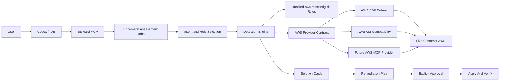

# BlueArch AWS Steward CTO Roadmap

## Product Direction

BlueArch AWS Steward is an MCP-first AWS solution engine. The user describes an
outcome in Codex or another agent host; Steward reads current AWS state, applies
the executable slice of `aws-misconfig-db`, returns prioritized solution cards,
and coordinates explicitly approved remediation.

The product does not depend on BlueArch Core, hosted sign-in, hosted telemetry,
or a persistent local AWS inventory. The AWS account remains the source of
truth.

The strategic rationale is maintained in
[`competitive-strategy.md`](competitive-strategy.md); delivery sequencing and
release gates are maintained in [`expansion-plan.md`](expansion-plan.md).

## Current Demonstrable Product

The current implementation provides:

- A dedicated zero-argument `bluearch-steward-mcp` process.
- A valid repo-local Codex plugin and MCP registration.
- Natural-language background assessments through `bluearch_assess`.
- Ephemeral assessment IDs with status, results, and 15-minute expiration.
- Service-level progress with resources scanned and findings discovered.
- Point-in-time solution cards with evidence, value, and remediation guidance.
- Resource details from the assessment, with optional live refresh.
- Assessment-based explain, plan, apply, and verify calls.
- AWS SDK as the bundled default provider.
- Short-lived, digest-bound plans plus explicit `allow_write: true` protection for supported writes.
- A complete 649-rule knowledge registry with explicit native, manual,
  metadata-required, signal-required, and specification-required modes.
- One hundred twenty executable rules across 17 runtime scopes.
- Partial results, cancellation, service failure isolation, and assessment-local metrics.
- Guarded remediation for eight narrowly scoped controls.
- Live Security Hub, Compute Optimizer, and Cost Optimization Hub adapters plus
  ephemeral Prowler/exported JSON imports.
- Stable cross-source fingerprints, provenance, freshness, deduplication, and
  explainable priority scores.
- LocalEmu fixtures and live AWS read-only provider parity tests.
- Complete local reports with automatic terminal PDF choice and evidence, risk,
  estimated savings status, confidence, and remediation safety by default.

The CLI and TUI remain development and troubleshooting surfaces. They are not
the product onboarding path.

## User Journey

```text
Install plugin/runtime once
  -> authenticate with normal AWS credentials or SSO
  -> ask an AWS outcome in natural language
  -> Steward offers possible objective and service responses when intent is unclear
  -> Steward asks for profile or region only when AWS context is ambiguous
  -> Steward validates caller identity
  -> Steward starts a background assessment
  -> agent polls the same assessment ID
  -> solution cards are presented
  -> user selects a resource
  -> Steward explains and plans
  -> user explicitly approves a supported write
  -> Steward applies and verifies live AWS state
```

Example request:

> Find my top AWS cost-reduction opportunities.

## Architecture



## Current Coverage

| Resource group | Executable checks | Write support |
| --- | --- | --- |
| Identity and audit | IAM, CloudTrail, CloudWatch Logs, and KMS controls | Guarded CloudTrail validation and log retention |
| Storage and data | S3, EBS, EFS, RDS, DynamoDB, Secrets Manager, SNS, and SQS controls | Guarded selected S3 controls |
| Compute and network | EC2, networking, Lambda, ECS, and ALB controls | Guarded ALB logging |
| API | API Gateway logging, tracing, and authorization controls | Planning only |

The competitive position is not the largest rule library. Steward complements
AWS native services and Prowler, then owns the local developer workflow from a
finding to a reviewed AWS or IaC fix and post-fix verification.

`bluearch_get_coverage` is the authoritative runtime response. Steward should
never claim generic AWS coverage for a resource without an executable rule,
evidence collector, and verification path. Every scan must show its detection
coverage, and zero findings must not be described as a pass for unevaluated
catalog rules.

## Next Milestones

### Milestone 1: Reliable MCP Distribution

- Publish signed macOS and Linux runtime binaries.
- Make plugin installation discover the runtime automatically.
- Add installation diagnostics and clear AWS SSO recovery guidance.
- Add integration tests against the packaged executable.
- Add semantic version compatibility between plugin and server.

Success criterion: a new user can install, connect, and complete a read-only
assessment without manually configuring Python or running a Steward command.

### Milestone 2: Consolidated Recommendation Queue (Delivered)

- Keep live adapters and imported evidence behind the typed read and untrusted-data boundaries.
- Preserve provenance, freshness, confidence, and source disagreement.
- Deduplicate native and external findings against the same live resource/problem.
- Refine the delivered score with blast radius, ownership, and
  Well-Architected weighting when those inputs can be collected safely.

Success criterion: one concise queue with current evidence and no duplicate
noise.

### Milestone 3: IaC Source Mapping And Patches

- Map live resources to Terraform and CloudFormation first.
- Generate a minimal patch, show the diff, and explain its effect.
- Run formatter, validation, policy checks, and repository tests.
- Verify the original finding after deployment.

Success criterion: a finding becomes a validated, reviewable code change.

### Milestone 4: Investigation Playbooks

- Add EKS performance, Lambda error, RDS pressure, ALB health, IAM privilege,
  and S3 exposure playbooks.
- Correlate resource state, metrics, logs, traces, and repository context.
- Add `bluearch_debug_resource` for deeper evidence collection.
- Separate symptom, likely root cause, uncertainty, and next diagnostic action.

Success criterion: Steward explains likely root cause instead of returning only
configuration state.

### Milestone 5: Selective Rule And EKS Expansion

- Select the next 20 native rules by workflow value and evidence quality.
- Add ECR, CloudFront, WAF, Route 53, Backup, and deeper existing-service rules.
- Add EKS and Kubernetes configuration and workload evidence.
- Require positive LocalEmu or documented fixture proof for every new rule.

Success criterion: every new rule unlocks a concrete investigation or fix path,
not merely a higher check count.

### Milestone 6: Team And Commercial Layer

- Signed and versioned knowledge bundles.
- Team policy packs and exceptions with owners and expiry.
- CI/SARIF enforcement after finding quality is trusted.
- Optional customer-controlled history and audit storage.
- GitHub, Jira, and Slack workflow integrations.
- Well-Architected value reporting across cost, security, reliability,
  operations, performance, and sustainability.

Hosted telemetry and customer inventory are not prerequisites for the local
product. Any future collection requires explicit opt-in and a separate privacy
review.

Commercial value should come from investigation, IaC remediation,
multi-account workflow, approvals, and governance. Additional premium rule
packs may support those workflows, but rule count is not the primary sales
claim.

## Demo Story

1. Show `bluearch_status` proving caller identity and current coverage.
2. Start with a vague request and show the guided objective and service responses.
3. Select a response, then resolve profile or region only when needed.
4. Show that the resumed `bluearch_assess` returns immediately with an assessment ID.
5. Show status polling instead of a blocked five-minute request.
6. Present grouped solution cards without dumping the account inventory.
7. Open one resource and show captured evidence plus observation time.
8. Generate a remediation plan using only assessment and finding IDs.
9. Show the write refusal without explicit approval.
10. Use LocalEmu for an approved S3 apply-and-verify demonstration.

## Decisions Already Made

- MCP and the agent plugin are the primary user experience.
- The AWS APIs are the source of truth.
- Assessments are ephemeral and point-in-time.
- AWS SDK is the default provider.
- AWS CLI is a compatibility fallback.
- AWS MCP will be an optional provider, not a second rule engine.
- No BlueArch Core dependency.
- No hosted telemetry or sign-in dependency.
- No automatic writes without explicit approval.
