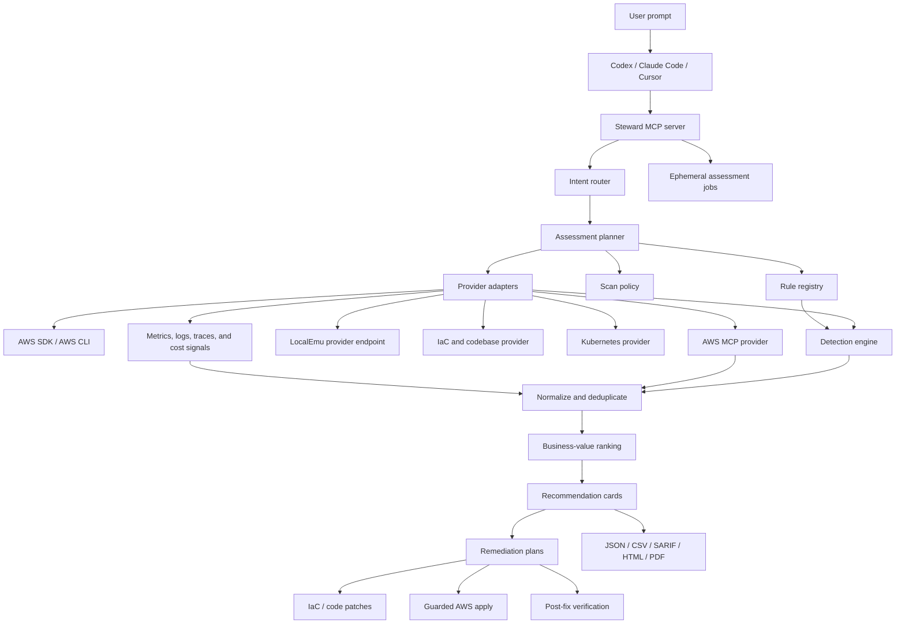

# BlueArch AWS Steward Expansion Plan

## Purpose

BlueArch AWS Steward should become a multi-recommendation engine for AWS
environments. The user describes an outcome in Codex, Claude Code, Cursor, or
another MCP host; Steward translates that prompt into scoped AWS evidence
collection, prioritized recommendations, safe remediation plans, code or IaC
patches when applicable, and post-fix verification.

The product direction is MCP-first. The CLI and TUI remain developer and demo
surfaces, but the primary experience is an agent asking for the right scope,
running point-in-time assessments, explaining findings, preparing fixes, and
executing only after explicit user approval.

## Product North Star

Steward should answer and act on prompts like:

- "Where can I reduce AWS cost this month?"
- "Harden my public internet exposure."
- "Find reliability risks before this production release."
- "Investigate performance issues in this EKS cluster."
- "Fix this finding in Terraform instead of changing AWS directly."
- "Generate an executive PDF report and a developer remediation plan."

The output should be recommendation cards, not raw inventory dumps. Each card
must include the matched rule, evidence, risk, likely business value, safe next
step, remediation mode, and verification command or tool call.

## Current Baseline

As of v0.7.0, Steward has:

- 100 free native rules across 16 runtime scopes.
- A 631-entry bundled knowledge catalog.
- LocalEmu positive fixture coverage for all active native rules.
- AWS SDK and AWS CLI provider paths.
- MCP assessment, status, results, resource details, report export,
  remediation planning, guarded apply, and verification tools.
- Ephemeral point-in-time assessments with no hosted telemetry, no sign-in, and
  no persistent AWS inventory.

This plan expands from configuration recommendations into operational,
performance, cost, security, and code-aware recommendations.

The first 100 canonical rules are the permanent open-source baseline. New
canonical rules after this line default to the `premium` access tier. Any
future entitlement layer must remain outside AWS evidence collection and must
not introduce hosted telemetry into the local scanner.

## Competitive Positioning

The durable positioning and packaging rationale is maintained in
[`competitive-strategy.md`](competitive-strategy.md). This document translates
that strategy into implementation sequencing and release gates.

Steward is not intended to win by having the largest check count. AWS native
services provide authoritative signals, Prowler provides broad open-source
coverage, compliance platforms own audit workflows, and enterprise CNAPPs own
large-scale correlation and attack graphs.

Steward's defensible category is the local, MCP-native
recommendation-to-remediation engine for AWS developers. It should consume
findings from those systems, refresh them with current AWS and repository
evidence, prioritize the work, prepare the smallest safe fix, and verify the
result.

Near-term investment priority is therefore:

1. consolidate and deduplicate findings from Steward, Security Hub, Prowler,
   Compute Optimizer, and Cost Optimization Hub;
2. map live resources and findings to their owning IaC or code;
3. add focused investigation playbooks for EKS, Lambda, RDS, ALB, IAM, and S3;
4. rank recommendations by business value, confidence, blast radius, effort,
   ownership, and Well-Architected pillar;
5. preserve the exact-plan approval and post-fix verification contract;
6. keep MCP installation and the first useful assessment frictionless.

Native rule expansion continues, but it supports these workflows rather than
becoming the primary product claim. The first 100 rules remain the permanent
open-source trust and adoption baseline.

## Guiding Principles

1. AWS is the runtime source of truth.
2. IaC is the preferred fix target when a resource is IaC-managed.
3. MCP is the product boundary for Codex, Claude Code, Cursor, and future IDEs.
4. Security Hub, Prowler, Compute Optimizer, and other scanners are signal
   providers to complement, not engines to duplicate blindly.
5. Recommendations must be evidence-backed and scoped to the user's prompt.
6. Missing evidence means unknown, not healthy.
7. Remediation must be planned, reviewable, reversible when possible, and
   explicitly approved.
8. LocalEmu fixtures must prove every active rule before release.
9. Rules must not expose secrets, full IAM policies, ECS environment values,
   Kubernetes secret values, or customer-sensitive payloads.
10. Hosted history, telemetry, and team policy are optional future layers, not
   prerequisites for local open-source value.

## Target Architecture



## Recommendation Types

### 1. Configuration Recommendations

These are deterministic checks against AWS control-plane state. Examples:

- public S3 bucket;
- missing log retention;
- unencrypted EBS volume;
- weak ALB TLS policy;
- RDS public access;
- KMS key rotation disabled.

These remain the easiest rules to automate and should continue to represent the
core native rule expansion path.

### 2. Cost Recommendations

These combine configuration, usage, and pricing signals. Examples:

- unattached EBS volumes;
- idle EC2 instances;
- idle RDS instances;
- unused Lambda functions;
- NAT Gateway and data-transfer waste;
- overprovisioned EKS node groups;
- missing S3 lifecycle controls with storage-age evidence.

Cost recommendations require confidence labels. If usage, age, billing, or
metric data is missing, Steward should explain the missing evidence instead of
inventing savings.

### 3. Security Recommendations

These combine exposure, permissions, encryption, logging, and runtime posture.
Examples:

- public ingress to sensitive ports;
- overprivileged IAM policies;
- EKS public endpoint without restrictive access;
- unencrypted secrets or queues;
- missing CloudTrail or GuardDuty coverage;
- public ECR repositories;
- missing WAF protections for public entry points.

Security recommendations should produce least-privilege remediation plans and
avoid dumping full policy documents in results.

### 4. Reliability Recommendations

These identify backup, failover, recovery, and resilience gaps. Examples:

- RDS without Multi-AZ;
- missing backups;
- single-AZ critical workloads;
- missing S3 versioning;
- unhealthy ALB target groups;
- EKS workloads without readiness probes or disruption budgets.

Reliability recommendations should include blast-radius notes and verification
steps.

### 5. Performance Recommendations

These require runtime signals and often need code or platform investigation.
Examples:

- EKS pods CPU-throttled or memory-constrained;
- ALB high target response time;
- Lambda high duration, timeout, or cold-start indicators;
- RDS high CPU, connection pressure, or storage latency;
- DynamoDB throttling;
- CloudFront cache miss patterns.

Performance recommendations should be two-stage:

1. detect the symptom from metrics and resource state;
2. inspect workload, IaC, manifests, or codebase when the user grants
   repository access.

### 6. Code And IaC Recommendations

These map live AWS findings back to source. Examples:

- Terraform security group rule patch;
- CloudFormation bucket encryption patch;
- CDK construct update;
- Kubernetes manifest resource request adjustment;
- Helm values change;
- Lambda timeout or memory update in IaC;
- application code fix suggested by logs or traces.

Steward should prefer a patch or pull request over direct AWS mutation when the
resource is IaC-managed.

## Rule Expansion Strategy

Do not convert all catalog entries into native detectors blindly. Prioritize
rules by:

- customer impact;
- frequency in real AWS accounts;
- evidence quality from public AWS APIs;
- feasibility in LocalEmu or mocked parity tests;
- safe remediation potential;
- ability to map to IaC;
- low false-positive risk.

Rule count is a quality and coverage measure, not the commercial north-star
metric. A new detector should be preferred when it unlocks a valuable
investigation, remediation, signal-correlation, or IaC workflow. Broad controls
that are already well served by Prowler or Security Hub should normally be
imported and live-revalidated instead of duplicated.

The machine-readable queue for this work lives in
[`expansion-backlog.json`](expansion-backlog.json). It should be updated before
new services or detector families are implemented.

Every executable rule needs:

- canonical rule ID and catalog mapping;
- objective tags such as cost, security, reliability, operations, performance,
  or sustainability;
- provider capabilities and read-only AWS operations;
- evidence schema;
- healthy-resource test;
- positive finding test;
- pagination test;
- partial-permission test;
- redaction test;
- LocalEmu positive proof or documented emulator limitation;
- remediation plan template;
- verification predicate;
- reporting fields;
- prompt examples.

## Rule Capability Phases

These phases group technical capability and fixture work. They are not the
product delivery order; the outcome roadmap below gives the commercial and user
sequence.

### Phase 1: Complete High-Value AWS Foundations

Add more depth to services already supported.

Priority rule families:

- S3 object lock, replication, intelligent tiering, stale multipart uploads.
- IAM unused users, unused roles, unused access keys, wildcard trust policies.
- EC2 public IP exposure, old AMIs, gp2 to gp3 migration, underutilized EBS.
- RDS backup retention, deletion protection, Performance Insights, engine
  version lifecycle.
- Lambda runtime lifecycle, reserved concurrency risk, DLQ or destination
  missing for async functions.
- ALB WAF missing, access-log destination health, listener rule exposure.

LocalEmu requirement:

- add one positive resource proof per rule;
- preserve one healthy control resource per service;
- document any rule that needs mocked historical state.

### Phase 2: Expand Into Cloud-Native Platform Services

Add service scopes with high customer relevance.

Priority services:

- EKS;
- DynamoDB;
- ECR;
- CloudFront;
- WAF;
- Route 53;
- AWS Backup;
- AWS Config;
- GuardDuty;
- Security Hub;
- OpenSearch;
- ElastiCache.

Initial EKS rules:

- public cluster endpoint without restricted CIDR;
- endpoint private access disabled;
- control plane logging disabled;
- secrets encryption disabled;
- old Kubernetes version;
- node group running old AMI or unsupported version;
- workloads missing resource requests or limits;
- workloads without readiness or liveness probes;
- pods repeatedly restarting;
- CPU throttling or memory pressure;
- public LoadBalancer services without annotation guardrails.

LocalEmu requirement:

- use LocalEmu for AWS-side EKS, IAM, EC2, and load balancer resources where
  supported;
- use a local Kubernetes fixture cluster or static Kubernetes manifest fixtures
  for workload-level findings;
- keep fixture state deterministic and offline.

### Phase 3: Add Signal-Based Recommendations

Add metrics, logs, traces, billing, and health-event inputs.

Signal sources:

- CloudWatch metrics;
- CloudWatch Logs Insights;
- AWS Cost Explorer;
- Compute Optimizer;
- Trusted Advisor where available;
- Health API where available;
- X-Ray traces;
- Container Insights and EKS control plane logs;
- CUR or cost reports when user provides access.

Rules in this phase must distinguish:

- no datapoints;
- insufficient datapoints;
- healthy datapoints;
- finding with confidence;
- provider permission missing.

LocalEmu requirement:

- seed deterministic CloudWatch metric datapoints where the emulator supports
  them;
- use provider stubs for APIs not available in LocalEmu Community;
- declare the exact simulated signal in `rule-map.yml`.

### Phase 4: IaC And Codebase Remediation

Add repository-aware remediation. This is where Steward becomes more than a
scanner.

Supported source types:

- Terraform HCL;
- CloudFormation YAML and JSON;
- AWS SAM;
- CDK synthesized templates first, CDK source later;
- Kubernetes YAML;
- Helm values;
- Kustomize overlays;
- Serverless Framework;
- GitHub Actions deployment workflows.

Core capabilities:

- map live resources to IaC resources using ARNs, tags, names, logical IDs, and
  CloudFormation stack metadata;
- classify a finding as `runtime_fix`, `iac_patch`, `code_patch`,
  `manual_review`, or `planning_only`;
- generate a minimal patch;
- explain why the patch fixes the finding;
- run local validation such as `terraform validate`, `cfn-lint`, `kubectl
  apply --dry-run=client`, or unit tests when available;
- create PR-ready diffs through the host agent instead of committing
  automatically.

EKS performance example:

```text
User: "Debug performance issues in this EKS cluster."

Steward:
  -> resolves account, region, and cluster
  -> reads EKS, node group, ALB, CloudWatch, and Kubernetes signals
  -> finds CPU throttling in deployment api
  -> maps deployment to k8s/apps/api-deployment.yaml
  -> checks resource requests, limits, HPA, readiness probes, and recent logs
  -> recommends a patch to requests/limits or HPA policy
  -> asks before editing files
  -> generates a patch
  -> runs manifest validation
  -> returns verification steps and optional follow-up scan
```

Guardrail:

Steward may edit local IaC or application files only through the host agent's
normal file-edit workflow. It must not silently change production AWS when a
source-controlled fix is appropriate.

### Phase 5: Multi-Account, Multi-Region, And Team Policy

Add organization-scale assessment without losing the local-first design.

Capabilities:

- profile and SSO account selection;
- multiple regions with explicit user confirmation;
- account grouping;
- policy packs;
- exceptions with owner and expiry;
- severity override rules;
- executive reporting;
- SARIF and CI gates;
- optional customer-controlled result storage.

LocalEmu requirement:

- simulate multiple accounts and regions where possible;
- use fixture labels when the emulator cannot represent organization APIs;
- keep CI deterministic.

## LocalEmu Expansion Plan

LocalEmu should remain the release gate for active native rules. The fixture
environment should grow in lockstep with the rule registry.

### Fixture Contract

For every active native rule, define:

- `rule_id`;
- service scope;
- fixture resource name;
- expected resource URI;
- expected evidence fields;
- provider path coverage: SDK, CLI, MCP;
- positive proof command or setup function;
- healthy control resource;
- emulator support mode: `native`, `overlay`, `stub`, or `external_fixture`;
- reason when not fully native.

### Fixture Layout

Recommended structure:

```text
tests/aws-emulator/
  compose.yml
  rule-map.yml
  expected/
    findings.native.json
  scripts/
    recreate.py
    validate-fixtures.py
    e2e-mcp.py
  fixtures/
    terraform/
    cloudformation/
    kubernetes/
    helm/
    metrics/
    logs/
```

### Service Fixture Backlog

Near-term additions:

- ECR repositories with public policy and unscanned images.
- DynamoDB tables without PITR or encryption variants.
- CloudFront distributions missing logging, TLS policy, or WAF.
- WAF web ACLs missing on public entry points.
- API Gateway HTTP APIs in addition to REST APIs.
- Route 53 public zones with risky records.
- AWS Backup vault and protected-resource coverage.
- GuardDuty and Security Hub disabled or missing standards.
- EKS cluster and Kubernetes workload fixture pack.

### Emulator Limitation Policy

If LocalEmu cannot create a realistic resource or signal:

1. prefer a provider stub for the exact API response;
2. keep at least one real LocalEmu resource underneath when possible;
3. mark the rule test mode in `rule-map.yml`;
4. add a live read-only AWS validation script when safe;
5. never change production detector behavior to satisfy emulator gaps.

## MCP And Agent Experience

Steward should ask for missing information instead of guessing:

- desired outcome;
- service scope;
- AWS profile;
- region;
- account;
- whether to include multiple services;
- whether to patch IaC or only provide a plan;
- whether write actions are allowed for a specific plan.

PDF generation is not an assessment prerequisite. Every completed assessment
offers a terminal Yes or No PDF choice automatically. Every displayed finding
and every report includes evidence, risk, estimated monthly savings or
`not_estimated`, confidence, and remediation support without requiring those
fields in the user's prompt.

MCP hosts differ in UI support. Every interactive step should provide both:

- structured form metadata for clients that support elicitation;
- `possible_responses` for clients that only support text fallback.

The agent should use this default loop:

```text
assess
  -> poll status
  -> get results
  -> ask PDF yes/no
  -> explain selected recommendation
  -> plan remediation
  -> choose fix target: AWS apply, IaC patch, code patch, or manual
  -> execute only after approval
  -> verify
```

## Remediation Expansion

### Remediation Modes

| Mode | Meaning | Example |
| --- | --- | --- |
| `planning_only` | Explain and prepare manual steps. | Rotate IAM access key. |
| `guarded_aws_apply` | Apply a narrow live AWS change after approval. | Set CloudWatch log retention. |
| `iac_patch` | Patch source-controlled infrastructure. | Add S3 encryption to Terraform. |
| `code_patch` | Patch application or workload code. | Add Kubernetes probes. |
| `debug_workflow` | Collect more evidence before recommending a fix. | Investigate EKS latency. |

### Write Expansion Order

Prefer low-risk reversible or additive writes first:

1. CloudWatch log retention.
2. S3 and ALB access logging to preexisting destinations.
3. Enabling encryption or versioning where safe.
4. Adding missing tags or metadata.
5. Enabling service logging.
6. IaC patches for high-risk infrastructure changes.
7. Manual-only plans for destructive or access-sensitive changes.

Never automatically:

- delete resources;
- rotate credentials;
- remove permissions;
- change traffic routing;
- stop production workloads;
- create buckets or logging destinations without explicit design;
- modify Kubernetes workloads without showing the patch.

## Reporting

Reports should support different audiences:

- JSON for integrations;
- CSV for spreadsheets;
- SARIF for CI and code scanning;
- Markdown for developer plans;
- HTML for local review;
- PDF for executive and audit use.

Implemented report foundations:

- JSON, CSV, SARIF, Markdown, HTML, and PDF exports;
- executive, technical, remediation, and complete profiles;
- evidence, risk, matching criteria, estimated savings status, confidence,
  remediation safety, and coverage limitations;
- automatic terminal Yes or No PDF choice;
- complete point-in-time export without another AWS scan.

Next report sections:

- findings by Well-Architected pillar;
- remediation mode breakdown;
- top 10 recommendations;
- IaC patch summary;
- imported-source provenance and deduplication summary;
- ownership, blast radius, and implementation effort;
- post-fix verification status and audit evidence.

At the end of every completed assessment, Steward asks whether to generate a
PDF report with a Yes or No choice.

## Release Gates

No rule becomes native unless all required gates pass:

- unit tests for vulnerable and healthy resources;
- pagination and permission-denied tests;
- redaction tests;
- LocalEmu positive proof or documented limitation;
- MCP E2E with actual stdio server;
- report rendering test;
- remediation plan test;
- verification predicate test;
- docs update;
- IAM read policy update;
- security review for new write actions.

No remediation write becomes supported unless:

- preconditions are re-read live;
- the plan is short-lived;
- the plan has a digest;
- the user explicitly approves;
- `allow_write=true` is required;
- verification runs after apply;
- rollback or manual recovery guidance is present.

## Outcome Roadmap

The time windows below are sequencing guidance, not external release
commitments. Each stage must finish with a demonstrable user outcome.

### Stage 0: Trusted Rule And Safety Baseline - Complete

- 100 free native rules across 16 scopes.
- Public LocalEmu proof and coverage matrix.
- MCP-first assessment, query, report, plan, guarded apply, and verification in
  a repository checkout.
- Evidence, risk, cost confidence, remediation safety, and terminal PDF choice
  as product defaults.

Proof of value: all active rules and the no-write assessment flow are
deterministically testable. Packaged onboarding remains the next stage.

### Stage 1: Frictionless MCP Distribution - Next

- Publish and test signed macOS and Linux runtimes.
- Generate ready-to-use Codex, Claude Code, and Cursor configurations.
- Detect stale or mismatched local runtime versions.
- Guide profile, Region, SSO recovery, and dependency problems without asking
  users to operate scan commands.
- Test clone or install to first useful assessment against a clean machine.

Proof of value: a new user reaches a useful read-only assessment in under ten
minutes.

### Stage 2: Consolidated Recommendation Queue (Delivered)

- Keep Security Hub, Compute Optimizer, Cost Optimization Hub, and Prowler
  behind the delivered normalization and provenance contracts.
- Deduplicate by account, Region, canonical resource, and canonical problem.
- Live-revalidate equivalent imported config findings before planning a fix.
- Extend the delivered risk, savings, freshness, remediation-readiness,
  corroboration, and effort score with ownership, blast radius, and
  Well-Architected weighting.

Proof of value: one concise queue with current evidence and no duplicate noise.

### Stage 3: IaC Source Mapping And Validated Patches

- Add `bluearch_find_iac_source`, `bluearch_plan_iac_patch`, and
  `bluearch_validate_patch`.
- Start with Terraform and CloudFormation, then Kubernetes manifests and Helm.
- Generate minimal reviewable diffs through the host agent.
- Run format, validate, policy, and repository tests before presenting a patch.
- Re-read AWS after deployment to verify the original finding.

Proof of value: a selected live finding becomes a validated, reviewable code
change without an unapproved production mutation.

### Stage 4: Investigation Playbooks

- Add `bluearch_debug_resource` and reusable evidence-collection playbooks.
- Prioritize EKS performance, Lambda errors, RDS pressure, ALB health, IAM
  privilege, and S3 exposure.
- Combine resource state, metrics, logs, traces, imported findings, and
  repository context.
- Distinguish root cause, contributing signals, uncertainty, and the next safe
  diagnostic action.

Proof of value: Steward explains likely root cause and proposes a validated fix,
not only a configuration finding.

### Stage 5: Selective Native Rule Expansion

- Select the next 20 detectors from the machine-readable backlog by workflow
  value and evidence quality, not catalog count.
- Prioritize ECR, CloudFront, WAF, Route 53, Backup, and deeper IAM, S3, EC2,
  RDS, Lambda, ALB, and DynamoDB controls.
- Require LocalEmu or documented stub proof for every detector.
- Keep broad overlapping checks as imported signals when native duplication
  would not improve investigation or remediation.

Proof of value: each new rule unlocks a concrete recommendation, playbook, or
fix path with low false-positive risk.

### Stage 6: EKS And Kubernetes Product Pack

- Add EKS and Kubernetes provider operations.
- Detect cluster configuration, logging, encryption, endpoint exposure, and
  version risks.
- Detect workload probe, resource-request, restart, throttling, and pressure
  conditions.
- Add deterministic LocalEmu AWS-side fixtures plus local Kubernetes fixtures.
- Map findings to Kubernetes YAML, Helm, or Kustomize and validate patches.

Proof of value: a cluster or workload symptom can be investigated, connected to
source, patched, and verified through one MCP workflow.

### Stage 7: Team And Commercial Workflow

- Add multi-account and all-Region orchestration.
- Add policy packs, exceptions with owner and expiry, approval records, and
  customer-controlled history.
- Add GitHub, Jira, and Slack workflow integrations plus branded reports.
- Add scheduled comparison and ownership without requiring hosted inventory.

Proof of value: teams pay for reduced remediation time, investigation, IaC
workflow, and governance rather than raw rule count.

## Success Measures

| Area | Measure |
| --- | --- |
| Activation | Median time from install to first useful recommendation is under ten minutes. |
| Signal quality | Percentage of presented findings with complete evidence, confidence, risk, and an actionable next step. |
| Noise | Deduplication rate and confirmed false-positive rate across native and imported signals. |
| Remediation | Median time from finding to validated plan or patch, plus percentage verified after deployment. |
| Safety | Write attempts rejected because approval, context, digest, or live preconditions do not match. |
| Commercial | Teams converting for IaC remediation, investigation packs, multi-account workflow, or governance. |

## Open Decisions

- Which AWS MCP capabilities add value beyond the existing AWS SDK provider;
  AWS MCP remains an optional adapter, not a second rule engine.
- Whether EKS live Kubernetes API access should be included in the core package
  or optional extras.
- Whether IaC patching should live in the same MCP server or a companion
  plugin package.
- How to represent team exceptions without introducing hosted state.
- Which commercial features, if any, require signed knowledge bundles or hosted
  policy distribution.
- How future source adapters should declare native-revalidation equivalence;
  Compute Optimizer and Cost Optimization Hub already support live and imported modes.
- How ownership and implementation effort should be inferred without exposing
  sensitive tags or repository metadata in reports.

## Immediate Next Steps

1. Keep this document as the expansion planning anchor.
2. Prove clean-machine MCP onboarding in under ten minutes and document any
   remaining runtime packaging blockers.
3. Add ownership and blast-radius inputs to the delivered explainable priority
   score without exposing sensitive tags or repository metadata.
4. Add source-specific operational health guidance for Security Hub, Compute
   Optimizer, and Cost Optimization Hub enablement and permissions.
5. Prototype Terraform and CloudFormation source mapping for three existing
   high-value findings before adding another broad detector batch.
6. Select the next 20 rules by workflow value and feasibility, then expand
   LocalEmu fixtures before marking them native.
7. Prototype the EKS read-only investigation flow separately from remediation.
8. Add MCP evaluation prompts and tests for aggregation, prioritization, IaC
   patching, EKS debugging, and verification.
