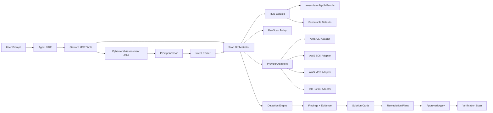
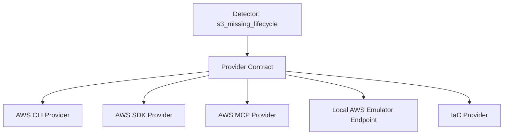

# BlueArch AWS Steward Future Architecture

## Purpose

BlueArch AWS Steward should become a local-first AWS solution engine for agent
workflows. A user should be able to describe the outcome they want, such as
"find cost savings in us-east-1" or "harden my public S3 buckets", and Steward
should convert that prompt into safe scans, prioritized solution cards,
remediation plans, and post-fix verification.

It should not compete with AWS native services, Prowler, compliance platforms,
or enterprise CNAPP products on check count alone. Steward's product boundary
is the last mile: consolidate their signals, add fresh AWS and repository
evidence, produce a reviewable fix, and verify the result inside the developer's
agent workflow.

See [`competitive-strategy.md`](competitive-strategy.md) for positioning and
[`expansion-plan.md`](expansion-plan.md) for delivery sequencing. This document
owns the technical boundaries and contracts.

The product stays independent from BlueArch Core. Its durable public boundary
is the rule knowledge base, provider adapters, MCP tools, and optional plugin/UI
surfaces. CLI commands remain developer diagnostics and compatibility helpers.

## Target Product Shape

The future app has five layers:

1. Agent and user surfaces.
2. MCP tool boundary.
3. Steward orchestration engine.
4. Rule, evidence, and remediation domain model.
5. AWS and IaC provider adapters.



## Core Flow

### Prompt To Solution Cards

`bluearch_assess` is the natural-language entrypoint. Its default
`architectural_review` mode resolves one live or proposed resource, selects a
validated knowledge pack, and inspects only the bounded dependency neighborhood
needed for that decision. Explicit full-account intent continues to start the
broader background assessment. The existing deterministic `bluearch_advise`
implementation remains available as a synchronous compatibility tool.

```text
Prompt
  -> resolve an explicit resource, changed IaC resource, identifier, or service
  -> return guided possible responses instead of guessing ambiguous focus
  -> ask only applicability-critical context questions
  -> resolve profile, region, and authentication with the user
  -> create ephemeral assessment ID
  -> select a versioned resource and operation knowledge pack
  -> collect the primary node and bounded typed relationships
  -> scan targeted live AWS, parse supplied IaC, or consume a scan_result
  -> normalize findings
  -> evaluate applicable Well-Architected practices and native rules
  -> store the point-in-time review for 15 minutes
  -> return results through the assessment ID
```

The advisor should return enough routing metadata for an agent to explain what
it did:

- inferred objective
- service and region
- bucket or resource scope
- selected rule filter
- result limits
- grouped solution counts
- returned resources only
- write guard status

### Solution Card Contract

A solution card is the model-facing answer unit.

```json
{
  "solution_id": "steward-abc123",
  "resource": "ebs://vol-example",
  "service": "ec2",
  "objective": "cost_optimization",
  "rule": "ec2-unattached-ebs-volume",
  "severity": "medium",
  "assessment": "finding",
  "business_value": "Potential cost reduction or waste avoidance.",
  "why": "The EBS volume has remained unattached beyond policy.",
  "recommended_fix": "Snapshot if required, then delete the unused volume.",
  "cost_estimate": {
    "status": "estimated",
    "estimated_monthly_savings_usd": 8.0,
    "confidence": "medium",
    "assumptions": ["Static regional storage rate; excludes IOPS and discounts."]
  },
  "requires_approval": true,
  "verification": "Re-read the volume inventory.",
  "plan_tool": {
    "name": "bluearch_plan_remediation",
    "finding_id": "steward-abc123"
  },
  "apply_guard": {
    "tool": "bluearch_plan_remediation",
    "apply_tool": "bluearch_apply_remediation",
    "required_flow": ["live_revalidation", "plan_id", "plan_digest", "allow_write=true"],
    "supported": false
  }
}
```

Agents should show solution cards by default instead of raw AWS inventory.
`apply_guard.supported` is true only for the eight implemented write paths:
`s3-public-bucket`, `s3-no-default-encryption`, `s3-no-lifecycle`,
`s3-server-access-logging-disabled`, `s3-versioning-disabled`,
`cloudwatch-log-retention-missing`, `cloudtrail-log-validation-disabled`, and
`alb-access-logging-disabled`. Every path is limited to one finding on one
resource. EC2/EBS and the remaining service rules stay planning-only.

For cost optimization, cards are ordered by confidence-weighted estimated
savings. The returned top-N is selected round-robin across service/rule groups
so one high-volume rule cannot hide other solutions. Group summaries are built
from the complete matched set, even when individual cards are capped.

`s3-no-lifecycle` is intentionally advisory when the provider has no storage
age, class, access, or billing evidence. It remains available in explicit and
`objective=all` scans but is excluded from broad cost opportunity results until
that evidence can support a savings estimate.

## MCP Contract

The MCP server is the primary product interface for agent hosts.

### Read-Only Tools

- `bluearch_list_aws_profiles`: non-secret local profile discovery for user selection.
- `bluearch_status`: runtime, AWS identity, and readiness.
- `bluearch_assess`: asynchronous natural-language assessment.
- `bluearch_get_scan_status`: background assessment state.
- `bluearch_get_scan_results`: point-in-time solution cards.
- `bluearch_get_resource_details`: captured or refreshed resource evidence.
- `bluearch_get_coverage`: full catalog evaluation modes plus executable service and rule coverage.
- `bluearch_rules_search`: complete catalog knowledge search without executing catalog text.
- `bluearch_import_findings`: ephemeral Security Hub ASFF and Prowler JSON normalization.
- `bluearch_explain_finding`: practical impact and evidence by assessment ID.
- `bluearch_plan_remediation`: no-write plan by assessment ID.
- `bluearch_verify_remediation`: post-fix verification scan.

The synchronous advisor, direct scan, rule search, opportunity, and doctor tools
remain for compatibility but are not the normal agent flow.

### Write Tool

- `bluearch_apply_remediation`: guarded write path.

The write tool must require an unexpired server-held plan, matching digest and
AWS context, unchanged live preconditions, explicit user approval, and
`allow_write=true`.
Advisor, scan, explain, plan, and verify tools must never mutate AWS.

## Provider Boundary

The detection engine should not know whether AWS state came from AWS CLI, AWS
SDK, AWS MCP, a local AWS emulator, or IaC. Providers should expose resource-state
operations, and detectors should consume normalized data.



Near-term provider priorities:

1. Use the bundled AWS SDK provider by default with service-specific pagination
   and error tests.
2. Keep the AWS CLI provider as an explicit compatibility fallback.
3. Add AWS MCP provider behind the same contract for agent-native host
   environments.
4. Add IaC provider for Terraform, CloudFormation, and CDK-generated templates.
5. Extend the delivered Security Hub, Compute Optimizer, Cost Optimization Hub,
   and Prowler adapters with future sources behind the same normalization and
   provenance contract.

The current implementation has this boundary and selectable AWS CLI/AWS SDK
providers:

```text
bluearch_aws_steward/providers/base.py      # provider protocol
bluearch_aws_steward/providers/factory.py   # provider selection and dependency checks
bluearch_aws_steward/providers/aws_sdk.py   # default boto3 provider implementation
bluearch_aws_steward/providers/aws_cli.py   # compatibility provider implementation
bluearch_aws_steward/detectors/s3.py        # detector depends on protocol
```

This makes the AWS access implementation replaceable without changing detector
logic. MCP callers use the bundled AWS SDK by default and may explicitly select
the AWS CLI compatibility provider.

## Rule Catalog Architecture

`aws-misconfig-db` remains the source of truth for rule metadata. Steward
bundles the complete knowledge catalog and a separate executable detector
slice at release time.

The current MVP uses two generated artifacts:

```text
bluearch_aws_steward/catalog/full_rules.json
bluearch_aws_steward/catalog/rules.json
```

`full_rules.json` contains all 649 source rows across 48 catalog service groups.
Each row has an evaluation object owned by Steward, not the source catalog:

| Mode | Rules | Runtime meaning |
| --- | ---: | --- |
| `native` | 100 | Typed collector and deterministic predicate implemented. |
| `native_alias` | 7 | Catalog alias routed to a canonical native rule. |
| `manual_review` | 117 | Requires human or organizational evidence. |
| `metadata_required` | 191 | Needs a normalized AWS resource collector and predicate. |
| `signal_required` | 5 | Needs a metric, log, flow, or performance signal adapter. |
| `specification_required` | 211 | Needs a reviewed detector specification. |

`rules.json` contains only the `native` slice. This prevents descriptive
catalog text from becoming executable behavior.

That bundle is marked with:

```json
{
  "source": "bluearchio/aws-misconfig-db"
}
```

Today it contains 120 canonical executable rules across 17 runtime scopes.
Aliases for EBS and networking route to the EC2 collector without increasing
that count. The authoritative rule list, IDs, thresholds, capabilities, and
test ownership are maintained in `docs/rule-coverage.md`.

The runtime uses the two registries as follows:

1. `catalog_registry.load_catalog_rules()` loads complete knowledge and support metadata.
2. `catalog.load_rules()` loads only reviewed executable rules.
3. `bluearch_rules_search` searches complete knowledge; scanners never execute those rows directly.
4. `filter_rules()` selects executable rules by service and text query.
5. `run_aws_scan()` dispatches IAM, KMS, Secrets Manager, CloudTrail,
   CloudWatch, DynamoDB, S3, EC2/EBS, EFS, Lambda, ECS, RDS, SNS, SQS, API
   Gateway, and ALB collectors and can combine them for `service=all`,
   optionally narrowed by `rule_filter`.
6. Each executable rule's `detector` field maps catalog metadata to detector
   code.
7. Findings reuse catalog fields such as `id`, `short_id`, `scenario`,
   `risk_detail`, `severity`, `remediation`, and executable `parameters`.
8. MCP tools return those fields as findings, opportunities, grouped rule
   cards, and solution cards.
9. Every scan reports catalog rules in scope, automated rules evaluated, and
   unevaluated rules. A zero-finding result never converts unknown rules into passes.

The sync path is explicit:

```bash
bluearch-steward rules sync --source ../aws-misconfig-db
bluearch-steward rules sync --source ../aws-misconfig-db --check
```

`rules sync` regenerates both artifacts. Exact source-ID mappings decide the
native slice. Every other row remains visible with a non-executable evaluation
mode, so the runtime is honest about what it can execute today.

Rule metadata should include:

- stable rule ID and short ID
- service and resource type
- scenarios and risk detail
- objectives such as cost, security, operations, and reliability
- Well-Architected pillar mappings
- detector references
- remediation plan templates
- verification requirements
- safety level and approval requirements
- executable detector defaults such as thresholds, pricing assumptions, and
  default exemption tags

Executable detectors should be code, but their identity and human-facing
knowledge should come from the catalog.

### Executable Parameters And Policy

The synchronized Steward bundle owns versioned executable defaults alongside
each mapped catalog rule. Current examples include EBS minimum unattached age,
CloudWatch target retention and materiality threshold, regional storage-rate
assumptions, and default exemption tags. This keeps detector behavior
reviewable and prevents business thresholds from becoming hidden constants.

CLI flags and MCP arguments create an immutable per-scan policy overlay. The
overlay can change age/retention/materiality thresholds and add tag exemptions
for that invocation; it never rewrites `aws-misconfig-db` or the bundled
catalog. The effective values are returned in finding evidence and scan
metadata for auditability.

## Orchestration Model

The orchestrator owns scan lifecycle:

1. Resolve scope.
2. Select rules.
3. Ask provider for resource state.
4. Run detectors.
5. Normalize findings.
6. Qualify cost evidence and calculate estimates with confidence and
   assumptions.
7. Rank by objective and select a diverse top-N across service/rule groups.
8. Build complete grouped summaries plus capped solution cards.
9. Plan remediation on selected findings.
10. Apply only after approval.
11. Verify with a fresh scan.

Each scan result should be timestamped evidence, not persistent current truth.
Saved reports are useful for demos, CI artifacts, and audit trails, but the app
should re-scan before claiming a resource is currently fixed.

## Future UI Surfaces

### IDE Plugin

The IDE plugin should be the main adoption surface after MCP is stable.

Expected views:

- prompt-driven AWS solution panel
- current findings table
- solution-card detail pane
- remediation plan preview
- IaC quick fixes
- verification status

### Terminal Dashboard

The TUI remains valuable for demos and power users. It should show:

- active scan status
- grouped rule counts
- filtered resource cards
- selected finding evidence
- copyable plan/apply commands
- verification result

### CI/CD

CI should be an enforcement surface, not the first product surface.

Expected outputs:

- JSON scan reports
- SARIF for code scanning
- markdown PR summaries
- threshold-based exit codes
- baseline suppression files

## Safety Model

Steward should follow strict write-safety rules:

- Discovery is read-only.
- Planning is read-only.
- Apply is explicit, scoped, and approval-gated.
- Verification always re-scans.
- Agents must not reimplement failed Steward checks with ad hoc AWS shell
  commands.
- Broad output should be capped and grouped.
- Public-facing exports should avoid raw inventory, ARNs, account IDs, policies,
  and tags unless the user explicitly asks for them.

## Rollout Phases

### Phase 1: MCP-First Agent MVP

- Implemented: dedicated `bluearch-steward-mcp` process.
- Implemented: ephemeral asynchronous `bluearch_assess` jobs.
- Implemented: guided objective and supported-service responses before AWS access.
- Implemented: resumable profile, region, and SSO authentication requests before scans.
- Implemented: structured MCP results alongside serialized JSON compatibility output.
- Implemented: status, results, resource details, coverage, and readiness tools.
- Implemented: complete 649-rule knowledge registry with explicit evaluation modes.
- Implemented: scan-level detection coverage that prevents false clean claims.
- Keep `bluearch_advise` for synchronous compatibility.
- Keep the 120-rule free baseline across 17 runtime scopes executable.
- Preserve LocalEmu and real AWS fixture coverage.
- Make MCP docs and plugin install flow reliable.

### Phase 2: Provider Refactor

Current status: implemented for the AWS CLI and AWS SDK providers.

- Formal provider interface is implemented.
- AWS CLI calls are behind provider methods.
- Bundled default AWS SDK provider is implemented.
- AWS CLI remains a compatibility provider.
- LocalEmu runs through the provider contract; LocalStack remains an optional
  compatibility target during migration.
- Read-only CloudWatch and EC2/EBS scans have a repeatable live parity harness
  that compares provider resource counts and finding identities.

### Phase 3: Multi-Service Rules

Current status: 120 canonical rules across 17 service scopes implemented.

- Implemented: unattached and unencrypted EBS detection plus unassociated Elastic IP detection.
- Implemented: CloudWatch Logs groups without retention policies.
- Implemented: IAM root controls, CloudTrail configuration, RDS static
  configuration, and Lambda active-tracing checks.
- Implemented: public S3 wildcard/delete policy checks and explicit TLS-policy enforcement.
- Implemented: EFS, ECS, ALB, expanded IAM/EC2/S3/Lambda/RDS rules, typed
  capabilities, assessment-local signals, partial results, and cancellation.
- Implemented: catalog-backed thresholds and exemptions, evidence-qualified
  cost estimates, advisory lifecycle gating, and diversity-aware top-N output.

Next executable coverage:

- Convert additional `metadata_required` rules service by service using typed
  provider snapshots and the executable rule registry.
- Expand the implemented signal-adapter boundary only where missing data can
  remain explicitly unknown and false-positive tests are available.
- Require fixtures, least-privilege read permissions, evidence contracts, and
  false-positive tests before changing a rule to `native`.
- Keep the 117 manual rules explicitly manual; they belong in guided
  Well-Architected review workflows, not synthetic resource findings.

### Phase 4: Signal Aggregation And Prioritization (Delivered)

- Live Security Hub, Compute Optimizer, and Cost Optimization Hub adapters use
  the typed read allowlist; Prowler and exported AWS JSON use the import path.
- Source-independent fingerprints deduplicate account, Region, resource, and
  canonical problem while preserving provenance and source disagreement.
- Equivalent imported config findings are live-revalidated before remediation.
- The current explainable score covers risk, savings, freshness/confidence,
  remediation readiness, corroboration, and implementation effort. Ownership,
  blast radius, and Well-Architected weighting remain future refinements.

### Phase 5: IaC And PR Workflow

- Parse Terraform and CloudFormation.
- Map IaC resources to the same rule IDs.
- Generate patch plans.
- Emit SARIF and PR comments.
- Verify live AWS after deployment when credentials are available.

### Phase 6: Investigation And Team Workflow

- EKS, Lambda, RDS, ALB, IAM, and S3 investigation playbooks.
- Metrics, logs, traces, Kubernetes state, and repository context.
- Optional team policy packs.
- Baselines and suppressions.
- Report history.
- Customer-controlled audit history; no hosted telemetry requirement.
- Organization-specific rule extensions.

## Design Principles

- Keep the local MCP server as the primary agent contract.
- Keep AWS credentials and inventory under the user's control.
- Prefer solution cards over raw findings.
- Treat remediation as a planned workflow, not a button.
- Keep rule knowledge in `aws-misconfig-db`.
- Keep provider implementation replaceable.
- Re-scan before claiming current state.
